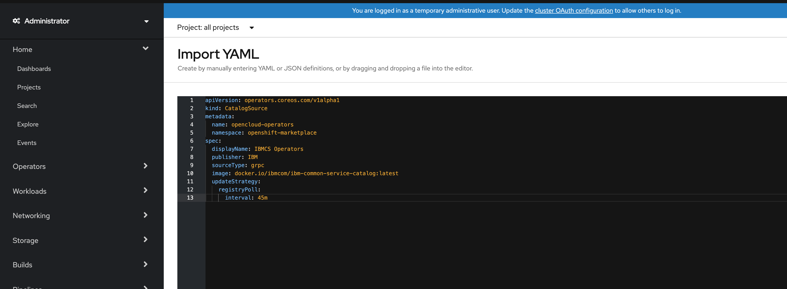

<!-- START doctoc generated TOC please keep comment here to allow auto update -->
<!-- DON'T EDIT THIS SECTION, INSTEAD RE-RUN doctoc TO UPDATE -->
**Table of Contents**  *generated with [DocToc](https://github.com/thlorenz/doctoc)*

- [CloudPak Integration](#cloudpak-integration)
  - [1.Create CatalogSource](#1create-catalogsource)
  - [2.Make CloudPak depends on IBM Common Service Operator](#2make-cloudpak-depends-on-ibm-common-service-operator)
  - [3.Install Individual Common Services](#3install-individual-common-services)

<!-- END doctoc generated TOC please keep comment here to allow auto update -->

# CloudPak Integration

Install IBM Common Services along with CloudPaks.

IBM Common Services is invisible to CloudPak users, when CloudPak users install the CloudPak, IBM Common Services will be seamlessly installed.


## 1.Create CatalogSource

The OLM uses CatalogSources, which use the Operator Registry API, to query for available Operators as well as upgrades for installed Operators.

You need to create the CatalogSource as a prerequisite for the IBM common services installation.

```yaml
apiVersion: operators.coreos.com/v1alpha1
kind: CatalogSource
metadata:
  name: opencloud-operators
  namespace: openshift-marketplace
spec:
  displayName: IBMCS Operators
  publisher: IBM
  sourceType: grpc
  image: quay.io/opencloudio/ibm-common-service-catalog:dev-latest
  updateStrategy:
    registryPoll:
      interval: 45m
```

Open the OpenShift Web Console, click the plus button in top right corner, and then copy the above CatalogSource into the editor.




## 2.Make CloudPak depends on IBM Common Service Operator

In CloudPak Operator CSV file, add following content.

This can ensure when users install CloudPak Operator, the IBM Common Service Operator will be also installed by OLM.

```yaml
apiVersion: operators.coreos.com/v1alpha1
kind: ClusterServiceVersion
metadata:
  name: cloudpak-operator.v0.0.1
  namespace: "placeholder"
spec:
  customresourcedefinitions:
    required:
    - description: CommonService is the Schema for the commonservices API
      displayName: CommonService
      kind: CommonService
      name: commonservices.operator.ibm.com
      version: v3
```

The logics inside IBM Common Service Operator is during the start the operator, it will:

1. Install ODLM operator in all namespaces mode
1. Create `ibm-common-services` namespace
1. Create IBM Common Services `OperandConfig` and `OperandRegistry`


## 3.Install Individual Common Services

Install individual common services by creating an OperandRequest.

```yaml
apiVersion: operator.ibm.com/v1alpha1
kind: OperandRequest
metadata:
  name: cloudpak-required-common-service
  namespace: "placeholder"
spec:
  requests:
    - operands:
        - name: ibm-licensing-operator
      registry: common-service
      registryNamespace: ibm-common-services
```

**Note:** You just need to request the required services and ODLM and common service operators will manage the service dependency. `ibm-cert-manager-operator` and  `ibm-mongodb-operator` are private operators in the dev channel. They can't be requested directly from other namespaces except `ibm-common-service`. ODLM will generate them if other operators depend on them.

CloudPaks can create this `OperandRequest` during [the CloudPak Operator start](https://github.com/IBM/ibm-common-service-operator/blob/master/cmd/manager/main.go#L121-L126), or have their own method to create this `OperandRequest`.

After created this `OperandRequest`, ODLM Operator will use it to trigger the individual common services installation.

**Note:**
If you want to install the 3.3 version common services, you need to use the following `OperandConfig` and `OperandRegistry` to replace the `OperandConfig` and `OperandRegistry` generated by ibm common service operator before you create the OperandRequest.

common services 3.3 OperandConfig:

```yaml
apiVersion: operator.ibm.com/v1alpha1
kind: OperandConfig
metadata:
  name: common-service
  namespace: ibm-common-services
spec:
  services:
  - name: ibm-metering-operator
    spec:
      metering: {}
      meteringUI: {}
  - name: ibm-licensing-operator
    spec:
      IBMLicensing: {}
  - name: ibm-mongodb-operator
    spec:
      mongoDB: {}
  - name: ibm-cert-manager-operator
    spec:
      certManager: {}
      issuer: {}
      certificate: {}
  - name: ibm-iam-operator
    spec:
      authentication: {}
      oidcclientwatcher: {}
      pap: {}
      policycontroller: {}
      policydecision: {}
      secretwatcher: {}
      securityonboarding: {}
  - name: ibm-im-operator
    spec:
      authentication: {}
      policydecision: {}
  - name: ibm-healthcheck-operator
    spec:
      healthService: {}
  - name: ibm-commonui-operator
    spec:
      commonWebUI: {}
      legacyHeader: {}
      navconfiguration: {}
  - name: ibm-management-ingress-operator
    spec:
      managementIngress: {}
  - name: ibm-ingress-nginx-operator
    spec:
      nginxIngress: {}
  - name: ibm-auditlogging-operator
    spec:
      auditLogging: {}
  - name: ibm-platform-api-operator
    spec:
      platformApi: {}
  - name: ibm-monitoring-exporters-operator
    spec:
      exporter: {}
  - name: ibm-monitoring-prometheusext-operator
    spec:
      prometheusExt: {}
  - name: ibm-monitoring-grafana-operator
    spec:
      grafana: {}
  - name: ibm-elastic-stack-operator
    spec:
      elasticStack: {}
```

common services 3.3 OperandRegistry:

```yaml
apiVersion: operator.ibm.com/v1alpha1
kind: OperandRegistry
metadata:
  name: common-service
  namespace: ibm-common-services
spec:
  operators:
  - name: ibm-metering-operator
    namespace: ibm-common-services
    channel: stable-v1
    packageName: ibm-metering-operator-app
    sourceName: opencloud-operators
    sourceNamespace: openshift-marketplace
    description: The service used to meter workloads in a kubernetes cluster
  - name: ibm-licensing-operator
    namespace: ibm-common-services
    channel: stable-v1
    packageName: ibm-licensing-operator-app
    sourceName: opencloud-operators
    sourceNamespace: openshift-marketplace
    description: The service used to management the license in a kubernetes cluster
  - name: ibm-mongodb-operator
    namespace: ibm-common-services
    channel: stable-v1
    packageName: ibm-mongodb-operator-app
    sourceName: opencloud-operators
    sourceNamespace: openshift-marketplace
    description: The service used to create mongodb in a kubernetes cluster
  - name: ibm-cert-manager-operator
    namespace: ibm-common-services
    channel: stable-v1
    packageName: ibm-cert-manager-operator
    sourceName: opencloud-operators
    sourceNamespace: openshift-marketplace
    description: Operator for managing deployment of cert-manager service.
  - name: ibm-iam-operator
    namespace: ibm-common-services
    channel: stable-v1
    packageName: ibm-iam-operator
    sourceName: opencloud-operators
    sourceNamespace: openshift-marketplace
    description: Operator for managing deployment of iam service.
  - name: ibm-healthcheck-operator
    namespace: ibm-common-services
    channel: stable-v1
    packageName: ibm-healthcheck-operator-app
    sourceName: opencloud-operators
    sourceNamespace: openshift-marketplace
    description: Operator for managing deployment of health check service.
  - name: ibm-commonui-operator
    namespace: ibm-common-services
    channel: stable-v1
    packageName: ibm-commonui-operator-app
    sourceName: opencloud-operators
    sourceNamespace: openshift-marketplace
    description: The service that services the login page, common header, LDAP, and Team resources pages
  - name: ibm-management-ingress-operator
    namespace: ibm-common-services
    channel: stable-v1
    packageName: ibm-management-ingress-operator-app
    sourceName: opencloud-operators
    sourceNamespace: openshift-marketplace
    description: Operator for managing deployment of management ingress service.
  - name: ibm-ingress-nginx-operator
    namespace: ibm-common-services
    channel: stable-v1
    packageName: ibm-ingress-nginx-operator-app
    sourceName: opencloud-operators
    sourceNamespace: openshift-marketplace
    description: Operator for managing deployment of ingress nginx service.
  - name: ibm-auditlogging-operator
    namespace: ibm-common-services
    channel: stable-v1
    packageName: ibm-auditlogging-operator-app
    sourceName: opencloud-operators
    sourceNamespace: openshift-marketplace
    description: Operator for managing deployment of auditlogging service.
  - name: ibm-platform-api-operator
    namespace: ibm-common-services
    channel: stable-v1
    packageName: ibm-platform-api-operator-app
    sourceName: opencloud-operators
    sourceNamespace: openshift-marketplace
    description: Operator for managing deployment of Platform API service.
  - name: ibm-monitoring-exporters-operator
    namespace: ibm-common-services
    channel: stable-v1
    packageName: ibm-monitoring-exporters-operator-app
    sourceName: opencloud-operators
    sourceNamespace: openshift-marketplace
    description: Operator to provision node-exporter, kube-state-metrics and collectd exporter with tls enabled.
  - name: ibm-monitoring-prometheusext-operator
    namespace: ibm-common-services
    channel: stable-v1
    packageName: ibm-monitoring-prometheusext-operator-app
    sourceName: opencloud-operators
    sourceNamespace: openshift-marketplace
    description: Operator to deploy Prometheus and Alertmanager instances with RBAC enabled. It will also enable Multicloud monitoring.
  - channel: stable-v1
    description: Operator to deploy Grafana instances with RBAC enabled.
    name: ibm-monitoring-grafana-operator
    namespace: ibm-common-services
    packageName: ibm-monitoring-grafana-operator-app
    scope: private
    sourceName: opencloud-operators
    sourceNamespace: openshift-marketplace
  - channel: stable-v1
    description: Operator that installs and manages Elastic Stack logging service instances.
    name: ibm-elastic-stack-operator
    namespace: ibm-common-services
    packageName: ibm-elastic-stack-operator-app
    scope: private
    sourceName: opencloud-operators
    sourceNamespace: openshift-marketplace
```
