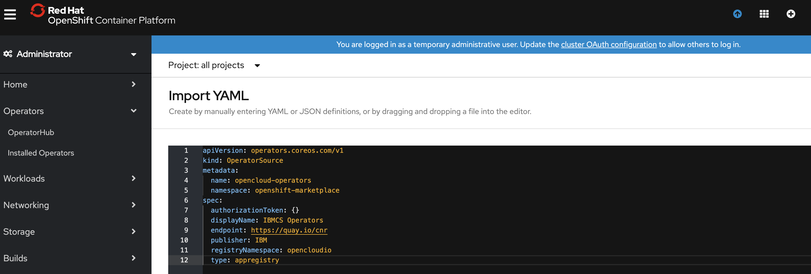

- [Install IBM Common Services](#install-ibm-common-services)
  * [1.Create OperatorSource](#1create-operatorsource)
  * [2.Create a Namespace](#2create-a-namespace)
  * [3.Install IBM Common Service Operator](#3install-ibm-common-service-operator)
    + [Search IBM Common Service Operator in the OperatorHub](#search-ibm-common-service-operator-in-the-operatorhub)
    + [Install IBM Common Service Operator](#install-ibm-common-service-operator)
  * [4.Install Individual Common Services](#4install-individual-common-services)
  * [5.Manage Individual Common Service Operators](#5manage-individual-common-service-operators)


# Install IBM Common Services

Install IBM Common Services on OpenShift 4.3+.

Usually IBM Common Services is packaged into the CloudPaks, if you install CloudPaks you will get IBM Common Services installed automatically.

If you want to install IBM Common Services only, you can follow the steps to install one or more individual common services.


## 1.Create OperatorSource

The OperatorSource is used to define the external data store used to store Operator bundles.

By default, OpenShift has build-in three OperatorSources and all the released IBM Common Services operators are published to one of the build-in OperatorSources, so if you want to install a released version of IBM Common Services, you don't need to create the OperatorSource.

But if you want to install a development version of IBM Common Services, then you need to create following OperatorSource.

```yaml
apiVersion: operators.coreos.com/v1
kind: OperatorSource
metadata:
  name: opencloud-operators
  namespace: openshift-marketplace
spec:
  authorizationToken: {}
  displayName: IBMCS Operators
  endpoint: https://quay.io/cnr
  publisher: IBM
  registryNamespace: opencloudio
  type: appregistry
```

Open the OpenShift Web Console, click the plus button in top right corner, and then copy the above operator source into the editor.



Check if operator packages are loaded, run command:

```bash
oc -n openshift-marketplace get operatorsource opencloud-operators -o jsonpath="{.status.packages}"
```

The output is a list of operators

```yaml
ibm-monitoring-prometheusext-operator-app,ibm-cert-manager-operator-app,ibm-commonui-operator-app,operand-deployment-lifecycle-manager-app...
```

**Note:** During development, if you need to update the csv package frequently, but the operator source needs a long time to sync the new package, you can delete the catalog source to trigger a reload. Then the new packages will be updated immediately.

```bash
oc -n openshift-marketplace delete catalogsource opencloud-operators
```


## 2.Create a Namespace

Navigate to `Projects` page in OpenShift console left menu, then `Create Project`, e.g., create a project named `common-service`.


## 3.Install IBM Common Service Operator

### Search IBM Common Service Operator in the OperatorHub

Navigate to `OperatorHub` page in OpenShift console, type `ibm-common-service-operator` in the search box.


### Install IBM Common Service Operator

Click and install IBM Common Service Operator into `common-service` namespace.


You can choose the `stable-v1` channel for installing the common service in the last release or choose the `dev` channel to install the latest version.

Waiting for few minutes the IBM Common Service Operator and ODLM will be installed.


So far, the IBM Common Service Operator and ODLM operator installation is completed. Next, you can start to install individual common services.

## 4.Install Individual Common Services

Install individual common services by creating an OperandRequest. All these common services will be deployed into namespace `ibm-common-services`, it cannot change.

```yaml
apiVersion: operator.ibm.com/v1alpha1
kind: OperandRequest
metadata:
  name: common-service
  namespace: ibm-common-services
spec:
  requests:
    - operands:
        - name: ibm-cert-manager-operator
        - name: ibm-mongodb-operator
        - name: ibm-iam-operator
        - name: ibm-monitoring-exporters-operator
        - name: ibm-monitoring-prometheusext-operator
        - name: ibm-monitoring-grafana-operator
        - name: ibm-healthcheck-operator
        - name: ibm-management-ingress-operator
        - name: ibm-licensing-operator
        - name: ibm-metering-operator
        - name: ibm-commonui-operator
        - name: ibm-elastic-stack-operator
        - name: ibm-ingress-nginx-operator
        - name: ibm-auditlogging-operator
        - name: ibm-platform-api-operator
        - name: ibm-helm-api-operator
        - name: ibm-helm-repo-operator
        - name: ibm-catalog-ui-operator
      registry: common-service
```

Open the OpenShift Web Console, click the plus button in top right corner, then copy the above OperandRequest into the editor and create.


## 5.Manage Individual Common Service Operators

Navigate to `Installed Operators` page in OpenShift console, click `ODLM` operator and choose project `ibm-common-services`, then click `All Instances`.

Then you can enable or disable one of the individual common services by editing the `OperandRequest`, and update the common service configuration by editing the `OperandConfig`.


If you want to uninstall IBM Common Services, you can remove the `OperandRequest` and uninstall IBM Common Service Operator and ODLM operator, then remove the `common-service` namespace.
