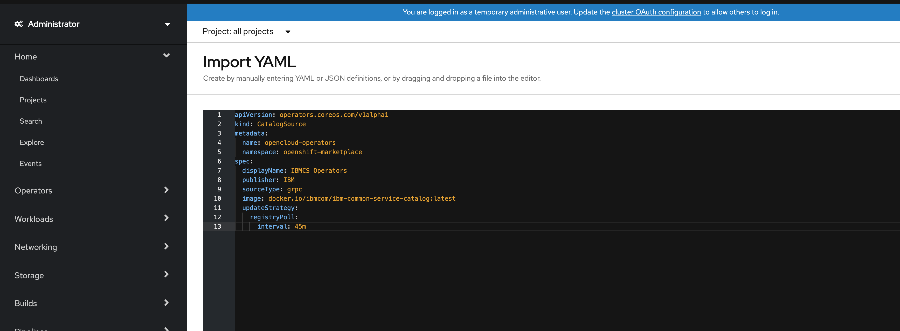
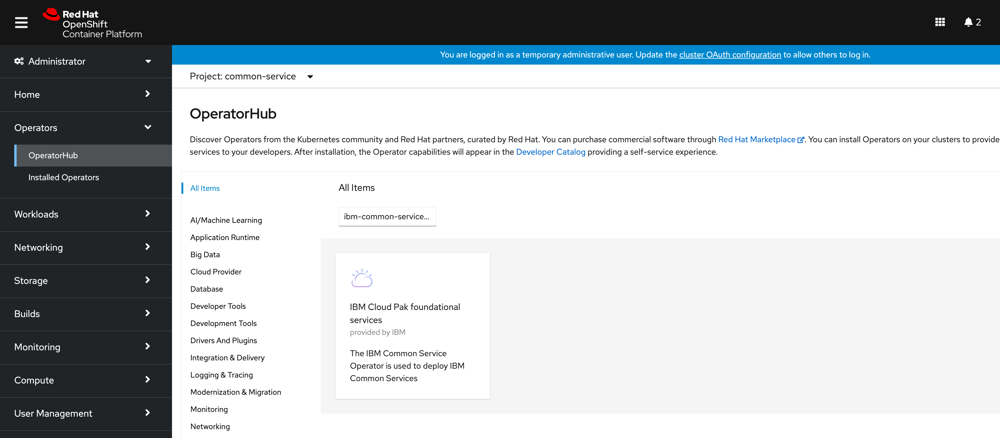
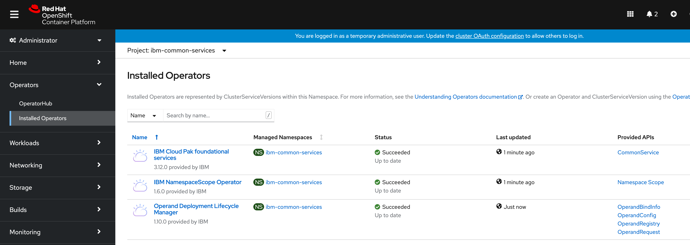

<!-- START doctoc generated TOC please keep comment here to allow auto update -->
<!-- DON'T EDIT THIS SECTION, INSTEAD RE-RUN doctoc TO UPDATE -->
**Table of Contents**  *generated with [DocToc](https://github.com/thlorenz/doctoc)*

- [Install IBM Common Services](#install-ibm-common-services)
  - [1.Create CatalogSource](#1create-catalogsource)
    - [For OpenShift 4.4 or later clusters](#for-openshift-44-or-later-clusters)
    - [For OpenShift 4.3 cluster](#for-openshift-43-cluster)
  - [2.Create a Namespace](#2create-a-namespace)
  - [3.Install IBM Common Service Operator](#3install-ibm-common-service-operator)
    - [Search IBM Common Service Operator in the OperatorHub](#search-ibm-common-service-operator-in-the-operatorhub)
    - [Install IBM Common Service Operator](#install-ibm-common-service-operator)
  - [4.Configure IBM Common Services](#4configure-ibm-common-services)
    - [Configure Size](#configure-size)
    - [Configure general parameters](#configure-general-parameters)
  - [5.Install Individual Common Services](#5install-individual-common-services)
  - [6.Manage Individual Common Service Operators](#6manage-individual-common-service-operators)

<!-- END doctoc generated TOC please keep comment here to allow auto update -->


# Install IBM Common Services

Install IBM Common Services on OpenShift 4.3+.

Usually IBM Common Services is packaged into the CloudPaks, if you install CloudPaks you will get IBM Common Services installed automatically.

If you want to install IBM Common Services only, you can follow the steps to install one or more individual common services.

**NOTE: This doc is only for developers and early adopters, please reference IBM Knowledge Center if you are a customer: https://www.ibm.com/support/knowledgecenter/SSHKN6/kc_welcome_cs.html**


## 1.Create CatalogSource

The CatalogSource is used to host IBM Common Services operators.

You need to create the CatalogSource as a prerequisite for the IBM common services installation.

### For OpenShift 4.4 or later clusters

```yaml
apiVersion: operators.coreos.com/v1alpha1
kind: CatalogSource
metadata:
  name: opencloud-operators
  namespace: openshift-marketplace
spec:
  displayName: IBMCS Operators
  publisher: IBM
  sourceType: grpc
  image: quay.io/opencloudio/ibm-common-service-catalog:latest
  updateStrategy:
    registryPoll:
      interval: 45m
```

Open the OpenShift Web Console, click the plus button in top right corner, and then copy the above CatalogSource into the editor.



Check if the CatalogSource pod is running or not:

```bash
oc -n openshift-marketplace get pod | grep opencloud-operators
```

The output is a running pod:

```yaml
opencloud-operators-6k6q8               1/1     Running   0          36m
```

### For OpenShift 4.3 cluster

Run following command to create the CatalogSource:

```
oc apply -f https://github.com/IBM/ibm-common-service-catalog/releases/download/v0.4.3/catalog.yaml
```

Check if the CatalogSource pod is running or not:

```bash
oc -n kube-system get pod | grep opencloud-operators
```

The output is a running pod:

```yaml
opencloud-operators-6k6q8               1/1     Running   0          36m
```

**Note:** Removing the CatalogSource pod will trigger an immediate reload of CatalogSource. And if you are using OpenShift v4.3 cluster, you need to manually remove the CatalogSource pod to trigger a reload, then the new operators will be updated automatically.

```bash
oc -n kube-system delete pod -l olm.catalogSource=opencloud-operators
```


## 2.Create a Namespace

Navigate to `Projects` page in OpenShift console left menu, then `Create Project`, e.g., create a project named `common-service`.


## 3.Install IBM Common Service Operator

### Search IBM Common Service Operator in the OperatorHub

Navigate to `OperatorHub` page in OpenShift console, type `ibm-common-service-operator` in the search box.



### Install IBM Common Service Operator

Click and install IBM Common Service Operator into `common-service` namespace.


You can choose the `stable-v1` channel for installing the common service in the last release or choose the `beta` channel to install the latest beta release.

Waiting for few minutes the IBM Common Service Operator and ODLM will be installed.



So far, the IBM Common Service Operator and ODLM operator installation is completed. Next, you can start to install individual common services.

## 4.Configure IBM Common Services

1. Navigate to `Installed Operators` and choose namespace `ibm-common-services`
2. In the `IBM Common Service Operator` row, click the Provided APIs `CommonService`
3. Select `common-service` and edit

### Configure Size

The IBM Common Service Operator will create the following CR in the `ibm-common-services` namespace. The initialized size is `medium`.

```yaml
apiVersion: operator.ibm.com/v3
kind: CommonService
metadata:
  name: common-service
  namespace: ibm-common-services
spec:
  size: medium
```

The supported sizes are: `small`, `medium` and `large`.

### Configure general parameters

Take MongoDB as an example, the following is configure MongoDB storage class:

```yaml
apiVersion: operator.ibm.com/v3
kind: CommonService
metadata:
  name: common-service
  namespace: ibm-common-services
spec:
  size: medium
  services:
  - name: ibm-mongodb-operator
    spec:
      mongoDB:
        storageClass: cephfs
```

## 5.Install Individual Common Services

Install individual common services by creating an OperandRequest. All these common services will be deployed into the namespace `ibm-common-services`, which cannot be changed.

```yaml
apiVersion: operator.ibm.com/v1alpha1
kind: OperandRequest
metadata:
  name: common-service
  namespace: ibm-common-services
spec:
  requests:
    - operands:
        - name: ibm-cert-manager-operator
        - name: ibm-mongodb-operator
        - name: ibm-iam-operator
        - name: ibm-monitoring-exporters-operator
        - name: ibm-monitoring-prometheusext-operator
        - name: ibm-monitoring-grafana-operator
        - name: ibm-healthcheck-operator
        - name: ibm-management-ingress-operator
        - name: ibm-licensing-operator
        - name: ibm-metering-operator
        - name: ibm-commonui-operator
        - name: ibm-ingress-nginx-operator
        - name: ibm-auditlogging-operator
        - name: ibm-platform-api-operator
      registry: common-service
```

Open the OpenShift Web Console, click the plus button in top right corner, then copy the above OperandRequest into the editor and create.


## 6.Manage Individual Common Service Operators

Navigate to `Installed Operators` page in OpenShift console, click `ODLM` operator and choose project `ibm-common-services`, then click `All Instances`.

Then you can enable or disable one of the individual common services by editing the `OperandRequest`, and update the common service configuration by editing the `OperandConfig`.


If you want to uninstall IBM Common Services, you can remove the `OperandRequest` and uninstall IBM Common Service Operator and ODLM operator, then remove the `common-service` namespace.
